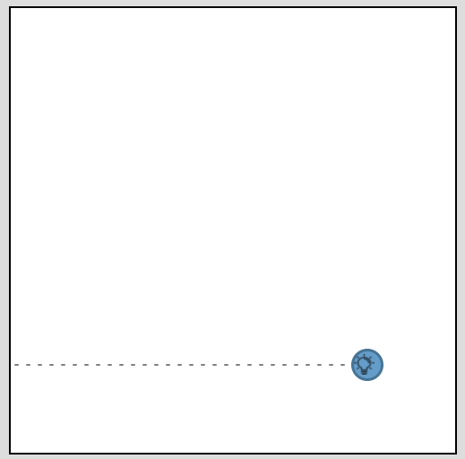

# Example script to process an ESDL file and get all geometry information out of it

A very simple example ESDL is provided, with multiple assets in different areas. The energy system
also contains a building with an asset.




See `data/Nieuw-Vennep.esdl` for the contents of the ESDL file

The output of the script for this ESDL file looks like this:

```
- Area 'Nieuw Vennep en omgeving' (ID:2c71b25a-2ed1-4bd9-9d9b-d7c33ced58af) has no geometry
  - Area 'NIEUW VENNEP - Nieuw-Vennep Zuid (bedrijventerrein)' (ID:2b2e7e92-96a8-4d00-942b-edc4c12c31cd) has geometry Polygon: [[[52.2511244222738, 4.63352610437902], ... [52.2511244222738, 4.63352610437902]]]
    - Building 'Building_0da6' (ID:0da66e2a-54e9-46e0-a206-f20ab9815eb5) has geometry Polygon: [[[52.255771110912455, 4.629828035831452], ... [52.255449301052884, 4.630182087421418]]]
      - ElectricityDemand 'Gebouwgebonden elektriciteitsgebruik' (ID:3de09b3b-3155-426b-8825-fe3eba56c1c2) has geometry Point: [100.0, 400.0]
    - ElectricityNetwork 'ElectricityNetwork_7c22' (ID:7c2217d9-2be6-4d58-bfbf-8acaaabf7844) has geometry Point: [52.25461685349278, 4.629492759704591]
    - ElectricityCable 'ElectricityCable_4fc0' (ID:4fc08efb-5cde-49e5-a469-ad154002c0ba) has geometry Line: [[52.25258082124078, 4.641766548156739], [52.25187147192467, 4.63524341583252], [52.25461685349278, 4.629492759704591]]
  - WindTurbine 'WindTurbine_3d40' (ID:3d40454c-17fd-4faf-9773-5f5822f1b047) has geometry Point: [52.25258082124078, 4.641766548156739]
```