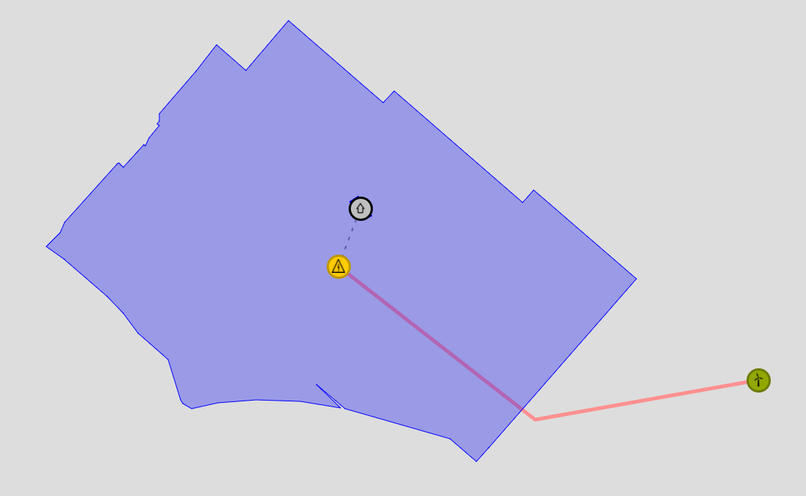
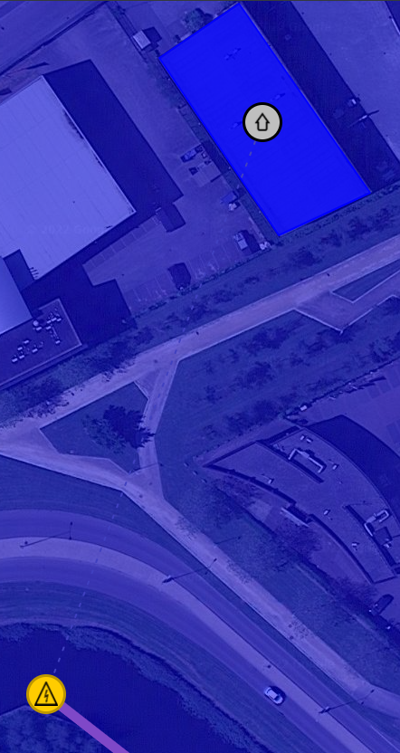

# Example script to process an ESDL file and print all geometry information

A very simple example ESDL is provided, with multiple assets in different areas. The energy system
also contains a building with an asset.

# Run script

Install dependencies
```
pip install -r requirements.txt
```

Run script
```shell
python main.py
```

# Example ESDL
See `data/Nieuw-Vennep.esdl` for the contents of the ESDL file

The output of the script for this ESDL file looks like this:

```
- Area 'Nieuw Vennep en omgeving' (ID:2c71b25a-2ed1-4bd9-9d9b-d7c33ced58af) has no geometry
  - Area 'NIEUW VENNEP - Nieuw-Vennep Zuid (bedrijventerrein)' (ID:2b2e7e92-96a8-4d00-942b-edc4c12c31cd) has geometry Polygon: [[[52.2511244222738, 4.63352610437902], ... [52.2511244222738, 4.63352610437902]]]
    - Building 'Building_0da6' (ID:0da66e2a-54e9-46e0-a206-f20ab9815eb5) has geometry Polygon: [[[52.255771110912455, 4.629828035831452], ... [52.255449301052884, 4.630182087421418]]]
      - ElectricityDemand 'Gebouwgebonden elektriciteitsgebruik' (ID:3de09b3b-3155-426b-8825-fe3eba56c1c2) has geometry Point: [100.0, 400.0]
    - ElectricityNetwork 'ElectricityNetwork_7c22' (ID:7c2217d9-2be6-4d58-bfbf-8acaaabf7844) has geometry Point: [52.25461685349278, 4.629492759704591]
    - ElectricityCable 'ElectricityCable_4fc0' (ID:4fc08efb-5cde-49e5-a469-ad154002c0ba) has geometry Line: [[52.25258082124078, 4.641766548156739], [52.25187147192467, 4.63524341583252], [52.25461685349278, 4.629492759704591]]
  - WindTurbine 'WindTurbine_3d40' (ID:3d40454c-17fd-4faf-9773-5f5822f1b047) has geometry Point: [52.25258082124078, 4.641766548156739]
```


The ESDL provided with this example is a very simple example. In the ESDL MapEditor it is visualized like this (without the map background):



An individual building has a geometry and the building icon is shown to be able to show connections to the assets inside the building:



When the user opens the BuildingEditor inside the MapEditor, the user sees the assets inside the building. The BuildingEditor has its own canvas of 500x500 pixels (the CRS attribute contains the value 'Simple').


